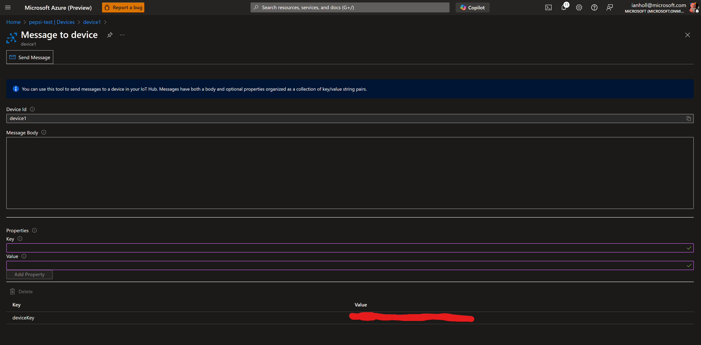

# DeviceKeyRollover

## This is just a sample not for production use

The code here is provided for demo purposes only and should not be construed as production ready code.  The code has been simplified for easier illustration of key points and not all error paths have been covered.

## Introduction
Sample code for an Azure IoT Hub device that illustrates rolling over the symmetric device key via a cloud-to-device message.  The code is written in C# using .Net Core 8. 

The symmetric device key 

The sample accepts cloud-to-device messages and processes specific requests to roll over the device key.  During the roll over process the device is disconnected from the IoT Hub and reconnected using the newly provided symetrical key.  The trigger for the key roll over is if cloud-to-device message contains a property named "deviceKey" and the expected value is a symmetric device key.

The sample also sends a periodic simple JSON telemetry payload to the IoT Hub every 10 seconds.  The telemetry looks like this (actual valkues are random within the range 20 - 35 and 60 - 80 respectively):

```
{
    "temperature" : 33,
    "humidity" : 67
}
```

Along with a message property "temperatureAlert" that is true or false depending if the temperature is over the threshold of 30.

## Requirements


### Pre-requisites

The code was wriitten using C# and the .Net Core runtimve version 8.0.  .Net core can be downloaded for your OS from [here](https://dotnet.microsoft.com/en-us/download/dotnet/8.0).

The necessary NuGet libraries to compile and run the code are as follows:

| Package Name                                          | Release Version                                           |
| ---                                                   | ---                                                       |
| Microsoft.Azure.Devices.Client                        | [](https://www.nuget.org/packages/Microsoft.Azure.Devices.Client/)    |
| Microsoft.Azure.Devices                               | [](https://www.nuget.org/packages/Microsoft.Azure.Devices.Provisioning.Service/)   |
| Microsoft.Azure.Devices.Shared                        | [](https://www.nuget.org/packages/Microsoft.Azure.Devices.Shared/)     |

For additional information on the Azure IoT C# SDK see the [GitHub repo here](https://github.com/Azure/azure-iot-sdk-csharp)

Once the pre-requisites have been installed you will need to conadd values specific to your instance of IoT Hub and device you identity you wish to test with.  These values should be entered into the deviceConfig.json file.

```
{
    "DeviceId":"<device name>",
    "HubHostname":"<Azure IoT Hub host name>",
    "DeviceKey":"<Current device key value>"
}
```

The HubHostname value can be gotten from [Azure Portal](https://portal.azure.com) by going to your IoT hub and copying the Hostname in the Overview tab.  Then in the Devices pageyou can find the device identity for the value of DeviceId.  Finally DeviceKey value can be found by clicking on the device you wish to test with then copying the Primary Key.

## Compiling and running

To build the code from the command line use:

```
dotnet build
```

Assuming a successful build you can execue the code with:

```
dotnet run
```

The output should be similar to the following:

```
4/9/2025 7:29:01 PM> Press Control+C at any time to quit the sample.

4/9/2025 7:29:01 PM> Subscribed to receive C2D messages over callback.

4/9/2025 7:29:01 PM> Device device1 waiting for C2D messages from the hub...
4/9/2025 7:29:01 PM> Use the Azure Portal IoT Hub blade or Azure IoT Explorer to send a message to this device.
Device sending message 1 to IoT hub.
Device sent message 1 to IoT hub.
Device sending message 2 to IoT hub.
Device sent message 2 to IoT hub.
```
To initialize a device key roll over go to the device page again and copy the Secondary Key.  Now click the "Message to Device" option at the top menu item and you should see the following page:



Under Properties add a key name of "deviceKey" and paste the copied Secondary Key value.  Click the "Add Property" button and you are ready to send a cloud to device message.  Click the "Send Message" button at the top and the message will be sent to the device.  You should then see the following output in the command window as the device disconnects, then reconnects with the new key and messages continue to be sent.  Something like this:

```
Device sending message 36 to IoT hub.
Device sent message 36 to IoT hub.
Device sending message 37 to IoT hub.
Device sent message 37 to IoT hub.
4/9/2025 7:35:06 PM> C2D message callback - message received with Id=.
4/9/2025 7:35:06 PM> Received message: []
	Property: key=deviceKey, value=**** deleted key for privacy ****
	Content type: text/plain; charset=UTF-8

4/9/2025 7:35:06 PM> Completed C2D message with Id=.
Disconnecting from IoT Hub
Reconnecting to the hub with the new device key
Connected to the hub with the new device key
Saving the new device key to the device config JSON file
Device sending message 38 to IoT hub.
Device sent message 38 to IoT hub.
Device sending message 39 to IoT hub.
Device sent message 39 to IoT hub.
```

## Things to consider

### Security of the device key
The key is stored across sessions in the deviceConfig.json file it should be initialized with correct values prior to the first run of this code.  In production it is not recommended to store the symmetric device key in the open like this instead either encrypt the value or store within a secure enclave.   

### Letting any cloud applications know the status of the devie key
It is advisable that the device use a reported property to indicate the current version or last updated date of the device key so admins know what devices are on what version of the device key.

### Cloud to Device message has a TTL (Time To Live)
Finally note that cloud-to-device messages have a life cycle and when applied to the hub they have a limited life time before they are expired and will not be sent to the device should it connect after the cloud-to-device message expires.  This is one reason to let the cloud side of your application when a device updates it's device key.

## alternate stratergies for updating the device key
Alternative strategies for updating the device key might be to use a desired property to send a new device key to a device and once it has been applied to the device send a reported property status that the key has been changed so it can be deleted from the device twin.  If the devices are generally always online this could also be performed via a direct method call passing in the new device key.  The processing of the key and subsequent disconnect/reconnect processing will be the same.

## x509 certs are a better solution to device security than symmetric keys
It is worth mentioning that the use of x509 certificates to establish operational identity of your device is a much more secure method of identifying your device to the IoT Hub.  This is especially true if the certificates are stored in a TPM or secure enclave on the device.  Please see the following for more information [Authenticate identities with X.509 certificates](https://learn.microsoft.com/en-us/azure/iot-hub/authenticate-authorize-x509)
